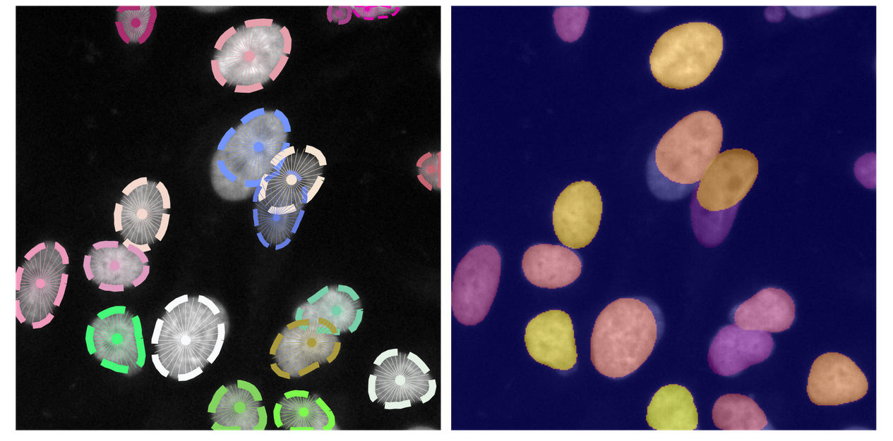

.. StarDistPyTorch documentation master file, created by
   sphinx-quickstart on Mon Mar 30 02:20:57 2020.
   You can adapt this file completely to your liking, but it should at least
   contain the root `toctree` directive.

Welcome to StarDistPyTorch's documentation!
===========================================

**StarDistPyTorch** is an attempt to reimplement **StarDist** in **PyTorch**. Many of the original, helper functions from *StarDist* are  re-used in *StarDistPyTorch*. Notable differences include:

* New function to patch images
* Slightly different loss function to incorporate class imbalance (In *StarDistPyTorch*, background pixels are weighted 10 times less than foreground pixels during the evaluation of the *Binary Cross Entropy Loss*)
* Grid is *not* downscaled (*StarDist* predicted on a downscaled-image to save memory)
* `self.train_foreground_only` parameter, which is used for effective sampling of patches during training in *StarDist*, is not implemented in *StarDistPyTorch*
* Shape completion is not implemented in *StarDistPyTorch*

Potential TODOs on the horizon include:

.. todo::
   
   | Adding functionality for *shape completion*
   | Adding functionality for evaluating *field of view*  

.. toctree::
   :maxdepth: 2
   :caption: Contents:
   
   v1.0

